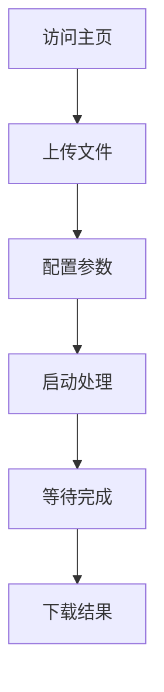

# 考勤分析系统前端产品需求文档

## 1. Product Overview
考勤分析系统前端是一个基于Web的用户界面，用于简化考勤数据处理流程。用户可以通过友好的界面上传考勤文档、配置分析参数、执行数据处理并下载结果文件。

该系统解决了考勤数据处理复杂、操作繁琐的问题，为HR和管理人员提供了一站式的考勤分析解决方案。

## 2. Core Features

### 2.1 User Roles
本系统为单用户系统，无需区分用户角色，所有功能对访问用户开放。

### 2.2 Feature Module
考勤分析系统前端包含以下主要页面：
1. **主页面**：文件上传区域、参数配置区域、处理控制区域、结果下载区域

### 2.3 Page Details

| Page Name | Module Name | Feature description |
|-----------|-------------|---------------------|
| 主页面 | 文件上传区域 | 支持上传7个Excel文件（basic.xlsx, business01.xlsx, business02.xlsx, freework01.xlsx, freework02.xlsx, overwork01.xlsx, overwork02.xlsx），显示上传进度和状态 |
| 主页面 | 参数配置区域 | 选择年份和月份，配置休息日列表，支持日期选择器和多选功能 |
| 主页面 | 处理控制区域 | 启动数据处理脚本，显示处理进度和状态，支持同步和异步执行模式 |
| 主页面 | 结果下载区域 | 显示生成的文件列表，提供文件下载功能，显示文件大小和生成时间 |

## 3. Core Process

用户操作流程：
1. 用户访问系统主页
2. 上传7个必需的Excel考勤文件
3. 配置分析参数（年月、休息日）
4. 启动数据处理
5. 等待处理完成
6. 下载生成的分析结果文件

## 4. User Interface Design

### 4.1 Design Style
- 主色调：蓝色系（#1890ff）和白色
- 辅助色：绿色（成功状态）、红色（错误状态）、橙色（警告状态）
- 按钮样式：圆角按钮，带阴影效果
- 字体：系统默认字体，标题16px，正文14px
- 布局风格：卡片式布局，顶部导航
- 图标风格：简洁的线性图标

### 4.2 Page Design Overview

| Page Name | Module Name | UI Elements |
|-----------|-------------|-------------|
| 主页面 | 文件上传区域 | 拖拽上传区域，文件列表，进度条，状态图标。使用卡片布局，蓝色边框，白色背景 |
| 主页面 | 参数配置区域 | 年月选择器，休息日多选框，确认按钮。使用表单布局，标签左对齐 |
| 主页面 | 处理控制区域 | 开始处理按钮，进度显示，状态文本。使用居中布局，大按钮设计 |
| 主页面 | 结果下载区域 | 文件列表表格，下载按钮，文件信息。使用表格布局，斑马纹样式 |

### 4.3 Responsiveness
系统采用响应式设计，支持桌面端和移动端访问，优先考虑桌面端体验，移动端进行适配优化。