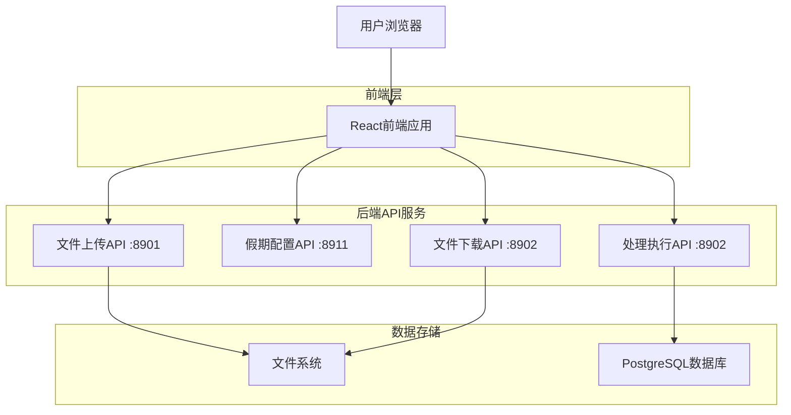

# 考勤分析系统前端技术架构文档

## 1. Architecture design



## 2. Technology Description

- Frontend: React@18 + TypeScript + Ant Design@5 + Axios + Vite
- Backend: 现有FastAPI服务（端口8901, 8902, 8911）
- 部署: 静态文件部署

## 3. Route definitions

| Route | Purpose |
|-------|----------|
| / | 主页面，包含所有功能模块 |

## 4. API definitions

### 4.1 Core API

文件上传接口
```
POST http://localhost:8901/upload
```

Request (multipart/form-